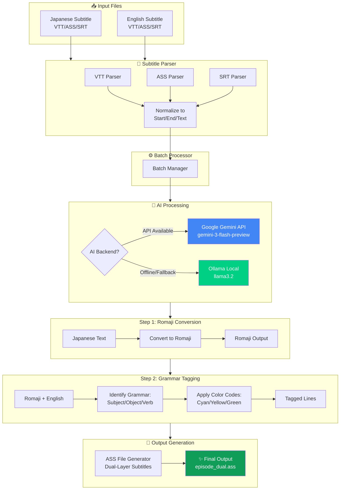
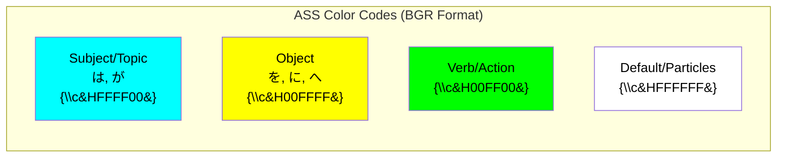
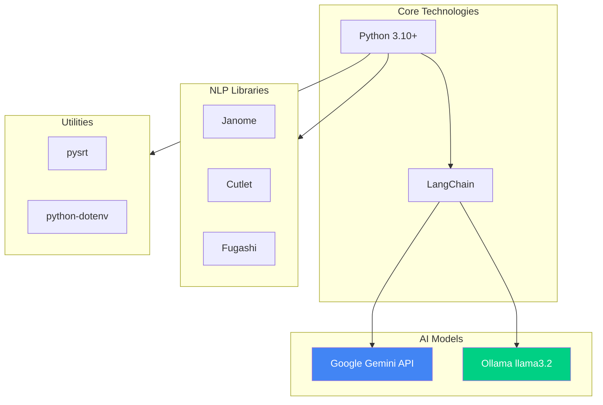

# Project Nakama - System Architecture

## Pipeline Architecture



## Color Coding System



## Technology Stack



## Data Flow Example

**Input:**
```
Japanese: 俺は海賊王になる
English: I will become the Pirate King
```

**Processing:**
1. **Romaji Conversion**: `Ore wa kaizoku-ō ni naru`
2. **Grammar Analysis**:
   - `Ore` (I) → Subject → Cyan
   - `kaizoku-ō` (Pirate King) → Object → Yellow
   - `naru` (become) → Verb → Green

**Output:**
```ass
Dialogue: {...,Romaji_Main,...,{\c&HFFFF00&}Ore{\c&HFFFFFF&} wa {\c&H00FFFF&}kaizoku-ō{\c&HFFFFFF&} ni {\c&H00FF00&}naru{\c&HFFFFFF&}
Dialogue: {...,English_Main,...,{\c&HFFFF00&}I{\c&HFFFFFF&} will {\c&H00FF00&}become{\c&HFFFFFF&} the {\c&H00FFFF&}Pirate King{\c&HFFFFFF&}
```

## Performance Metrics

- **Batch Size**: 20 lines
- **Processing Speed**: ~50-100 lines/minute (depends on AI backend)
- **Memory Usage**: Minimal (streaming batch processing)
- **Token Usage**: ~27K tokens per 20-min episode
- **Output Size**: ~36-70 KB per episode
